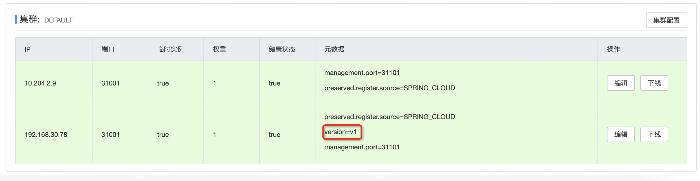
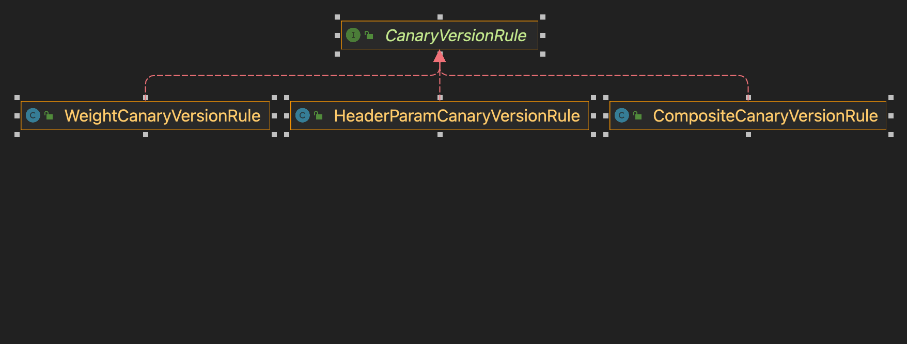
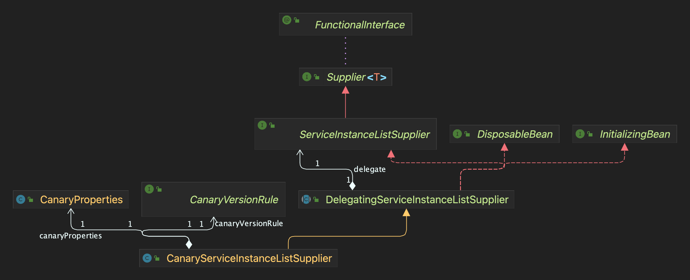

## 介绍

### 解决什么问题
一个变更，如果在发布后立即全量上线，出现问题影响的是全量的用户。灰度过程，就是控制影响范围，通过逐步放量，结合监控和日志， 将问题带来的影响面控制在有限的范围内。
### 过程推进
白名单 → 10%用户 → 50%用户 → 100%用户
### 需要解决的问题
* 如何区分灰度机器和正式机器
* 如何控制流量转发

## 灰度方案
将机器分为灰度组和正式组，gateway根据请求信息判断应该路由到哪组


## 实现
### 如何区分灰度机器和正式机器
创建第二组机器，nacos注册元数据里添加灰度版本信息
```
spring:
  cloud:
    nacos:
      discovery:
        metadata:
          version: v1
```


### 如何控制流量转发
gateway负载均衡逻辑
+ ServiceInstanceListSupplier根据serviceId获取所有实例
+ ReactiveLoadBalancer选择一个实例

通过自定义CanaryServiceInstanceListSupplier,来控制流量转发
+ 根据请求参数和灰度规则计算应该命中哪个版本
+ 根据版本过滤实例

#### 计算命中的灰度版本



灰度规则定义
```
canary:
  enabled: false #灰度功能总开关 
  services:
    - serviceId: user #服务名 
      weightEnabled: true #权重开关
      versions:
        - version: v1 #灰度版本号 
          headerParam: #白名单匹配
            device_id: 41ec3710f89a6132,6e9b1c790c2946ac
            userId: 1111111,222222
          weight: 0 # 权重值 0到100
```            

#### 根据版本过滤实例



## 上线流程
1. 流量都切到正式组
```
canary:
  enabled: true
  services:
    - serviceId: user
      weightEnabled: false
      versions:
        - version: v1 #灰度版本号 
          headerParam: #白名单匹配
            device_id: 41ec3710f89a6132,6e9b1c790c2946ac
            userId: 1111111,222222
          weight:
```
2. 发布灰度组
3. 白名单测试
4. 按10%、50%、100%逐渐将流量切到灰度组
```
canary:
  enabled: true
  services:
    - serviceId: user
      weightEnabled: true
      versions:
        - version: v1 #灰度版本号 
          headerParam: #白名单匹配
            device_id: 41ec3710f89a6132,6e9b1c790c2946ac
            userId: 1111111,222222
          weight: 10
```
5. 发布正式组
6. 关闭灰度功能
   canary:
   enabled: false
   services:
    - serviceId: user
      weightEnabled: false
      versions:
        - version: v1 #灰度版本号
          headerParam: #白名单匹配
          device_id: 41ec3710f89a6132,6e9b1c790c2946ac
          userId: 1111111,222222
          weight: 10

